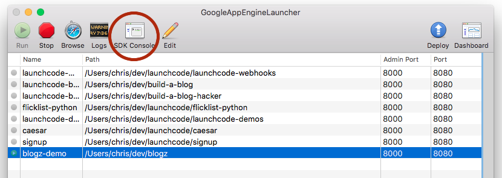
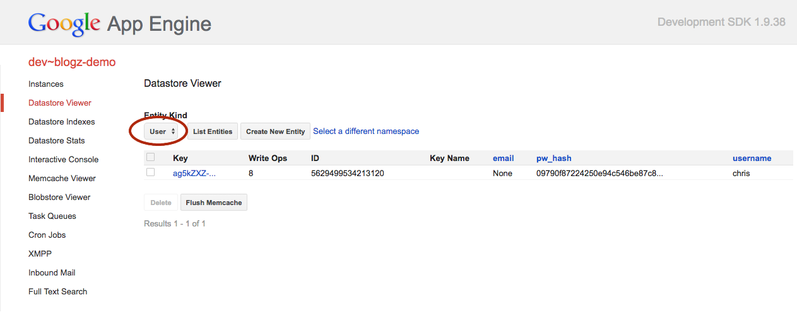

# Assignment: Blogz

For the last problem set, we built a blog. We were able to persist data in the datastore and retrieve that data for display. However, there are still some serious feature gaps. We're going to fill those in during this problem set.

We'll add authentication, so that users have to log in to create posts. Additionally, users will have their own blogs, and visitors will be able to view an individual's blog on it's own, or a listing of all blog posts on the site. Finally, our site will be usable by the rest of the world!

Throughout the assignment, refer to the [demo app][blogz-demo]. Feel free to create an account, make a post or two, and poke around.

### Setting up

LaunchCode staff has done a bit of work to get started on this project, so you'll start by checking out the code from GitHub. Visit the [repository page on GitHub][blogz-repo] and fork the project. Recall that this creats a copy of the project under your personal GitHub account.

Then, clone your fork/copy to your machine and make a new App Engine app. This process is the same as the "Clone the repository" and "Create new App Engine app" sections of [Class 3 setup][class-3-setup], with your blogz page in place of the flicklist-python page, and with the app ID `blogz` in place of `flicklist-python`.

If you try to run the app at this point, you will enounter errors. We have left out some important code, which you'll be writing for this assignment.

For an in-depth look at the starter code, watch the [walkthrough][starter-code-walkthrough].

### Starter code

Review the starter code in the project. It is essentially the solution to the build-a-blog assignment, with a few notable additions. In particular, we've added most of the code necessary to allow users to create accounts and log in and out.

##### User accounts

There are three handlers associated with user account actions: `SignupHandler`, `LoginHandler`, and `LogoutHandler`. Most of the code required to make these work properly is in place. You should read through it all, and hopefully you'll find much of it familiar.

The `SignupHandler` should look familiar to you; it is essentially the solution to the Signup portion of the Formation problem set from earlier in the unit. The one notable update to `SignupHandler` is that when a user submits data that validates, we are now able to create a new `User` object to represent the user and store it in the database. Have a look at `SignupHandler` and the `User` model class to see how these work.

The `User` class is in the file `models.py`, which also contains the `Post` model class. These classes represent a user of the site -- that is, somebody with an account -- and a blog post, respectively. We put our model classes in a separate file for organizational purposes, and then import them at the top of `main.py`.

##### `hashutils.py`

Open up `hashutils.py`. Here you'll find code that should look familiar from recent lessons on cookies and hashing. In fact, much of this code is nearly identical to what you wrote in the quizzes for Lesson 4 in the Udacity course. In `main.py`, we've imported the `hashutils` module and used it to create and validate secure hashes for cookies and passwords in `SignupHandler` and `LoginHandler`.

Read through the code in `hashutils.py`, as well as where it is used in `main.py`, to be sure you understand what these functions do, and how they're used for cookie and account management.

That's a very quick, high-level introduction to the starter code. Spend some time with it, and when you're ready, dive into your tasks below.

### Add login form

Start up the app and visit the path `/signup`. Go ahead and fill out the form to create an account for yourself. There are two ways to verify that this worked:

**Method 1:** You are redirected to the `/blog/newpost` page, and if you look at the cookies stored in your browser, you'll see one with the name `user_id`. To view your cookies, open up the developer tools in your browser, and type `document.cookie` in the console (you may see other cookies too).

**Method 2:** Visit the SDK Console for Google App Engine. Here's how to launch it from the GAE Launcher:

Then visit the "Datastore Viewer" link and select User from the Entity Kind dropdown, and hit List Entities to display all users. You should see a row for the user you just created.

If you then visit the path `/logout`, you'll be logged out. To allow users to log in and out conveniently, do the following:

* Create a `login.html` template that extends `base.html`. It should contain a form with a username and password field, and a submit button. To figure out exactly what the field names should be, and how the form should be submitted, look at `LoginHandler` and note that its route is set up to be `/login`. The template will be passed a parameter named `error` in the case of a login error, such as incorrect password or username. Make sure to display this error somewhere in your template. You may use the CSS class `error` to have this message styled appropriately.
* In `base.html` add links for logging in and logging out. The login link should take the user to the login form. The logout link should take the user to `/logout`, which will log the user out and redirect them to another page. You don't need to worry about only displaying these when a user is logged in, as many sites behave. These links will be visible for all site visitors, regardless of whether or not they are logged in.

Note that we have a `login.html` template and a `signup.html` template, but no `logout.html` template. It turns out that we don't need a template for logging out. Think about why this is the case. What makes logging out different from logging in, or creating an account?

### Add `author` field to `Post`

We saw above that our `models.py` file contains the two model classes for our application: `Post` and `User`. However, they are not yet linked in any way. If a `User` is able to create posts, and each post is created by a `User`, then there should be some explicit link between the two objects.

Your task is to add an `author` field to the `Post` model class, so that each post will formaly belong to the user that created it. To do this, add the field as a `db.ReferenceProperty`, just as we did in the last Flicklist studio. This property should be required.

Once you've done this, create a new post or two, and visit the SDK Console to confirm that your new post has a value in the `author` column. This value will not make much sense (it's a string of various characters) but it's presence is enough to tell you that you did this part correctly.

We can also see our posts via the "all posts" link (or, equivalently, the path `/blog`). We eventually want to be able to display only the posts written by a specific user. We'll tackle that in the next section.

> If you create posts before adding the `author` field, such posts will break the main `/blog` page. Via the SDK Console, delete any posts that don't have a value in the `author` column.

### Implement `get_posts_by_user`

Near the top of `main.py` is the `BlogHandler` class, which each of our own handers extends. The `BlogHandler` includes some important utilities that we'll need to use throughout our app. In particular, it will help us fetch blog post data from the database.

The first method, `get_posts(self, limit, offset)`, fetches posts by all users from the database so that:

* Posts are ordered by time created, in descending order (newest post first)
* Only `limit` posts are returned. So if limit is 5, we get 5 posts back.
* The posts that are returned start with post number `offset + 1`. In other words, if `offset` is 10 and `limit` is 5, we get posts 11-15.

The code is written this way to enable us to implement "paging", where we display a limited number of posts per page, and allow the user to view subsequent pages. This behavior is useful when there are a large number of blog posts, and it is primarily implemented in `BlogIndexHandler`. `get_posts` uses the `Query` class from `google.appengine.ext.db`, which we encountered in the last Flicklist studio.

Many application frameworks will make it possible for you to retrieve data either via a direct query (as we do in `get_user_by_name`) or via some special methods that it provides in an **object-relational mapping (ORM)** library. When dealing with more complicated queries, it's prefereable to use the ORM library since it can easily handle complicated filtering with big data sets, as well as object relationships. [Read more about the `Query` class][gae-query-class] in Google's documentation.

To allow visitors to view a user's blog (i.e. all posts from a given user), we need to finish implementing the `get_posts_by_user` method. We've started it for you, but you'll need to finish. You'll need to do something similar to `get_posts`, but you'll need to filter based on the `author` field. Refer to the [documentation for the `filter` method][gae-query-filter], as well as the last Flicklist studio.

If you've properly implemented this method, you will be able to use paths of the form `/blog/USERNAME` (substituting an actual username for USERNAME) to view recent posts by a specific user. We've done the work of displaying these posts, and properly handling the special URLs, in the routes section at the bottom of `main.py`, and in `BlogIndexHandler`.

To test your code you should create a few posts under multiple user accounts, and check that they display properly when using the user-specific blog URLs.

### Add author links

Now visitors can go to paths like `/blog/jesse` to see a specific user's blog posts. But how will they know that they can do this? We need to provide an intuitive way for visitors to find their way to these pages.

#### Author links on post lists

The `blog.html` template is where we list out several posts on a single page. It is rendered by `BlogIndexHandler`.

Modify this template so that below each post is a link to the author's blog. Refer to the [demo app][blogz-demo-blog] to see precisely how this should look and work.

#### Author links below individual post pages

Like in the Build-a-blog assignment, post titles have permalinks which link to the unique page for each post. A path for such a link might look like `/blog/6192449487634432`. These pages use the `post.html` template and are handled by `ViewPostHandler`, and they currently display only the date that the post was written on, just below the post body. As above, modify this template to display the author, and link back to the author's blog page.

When you're done with this task, you're ready to submit.

## Submitting Your Work

When you are ready to submit, make sure you `add`, `commit` and `push` all the changes you have made, so that your remote repo is up to date with the work you have done locally.

On Vocareum, clone your repository into your `work/` folder and then Click submit.

> Remember that you should ignore any Udacity instructions about hosting your app out on the internet and posting the link so they can grade it. You don't have to submit your work to Udacity, you just have to submit to LaunchCode on Vocareum.

[blogz-demo]: http://blogz-demo.appspot.com/
[blogz-demo-blog]: http://blogz-demo.appspot.com/blog
[blogz-repo]: https://github.com/LaunchCodeEducation/blogz
[class-3-setup]: ../class3/
[gae-query-class]: https://cloud.google.com/appengine/docs/python/datastore/queryclass
[gae-query-filter]: https://cloud.google.com/appengine/docs/python/datastore/queryclass#Query_filter
[starter-code-walkthrough]: https://youtu.be/KtPNiBUlqA0
