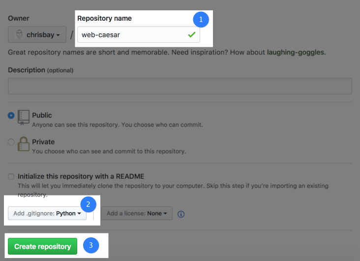
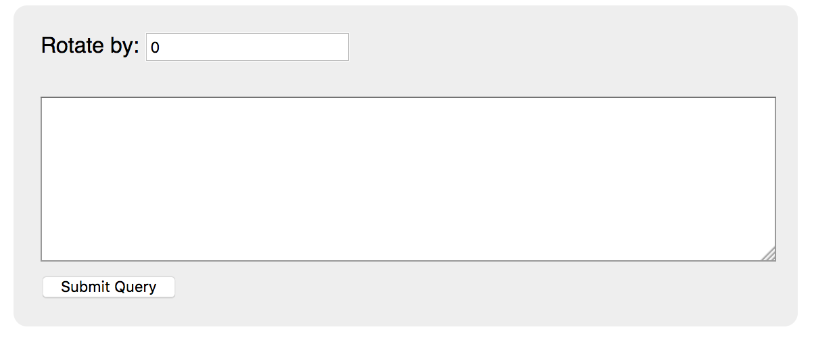

In this assignment you'll implement a web-based version of the Caesar cipher that you wrote in Unit 1. It consists of the following sections:

- [Git Repository Setup](#git-repository-setup)
- [Creating a Virtual Environment](#creating-a-virtual-environment)
- [Setting up a basic Flask app](#setting-up-a-basic-flask-app)
- [Rendering a form](#rendering-a-form)
- [Importing caesar code](#importing-caesar-code)
- [Processing the form](#processing-the-form)
- [Rendering the form after encryption](#rendering-the-form-after-encryption)
- [Committing Your Work](#committing-your-work)

Your final application will function just like our [demo app](https://launchcode-demos.appspot.com/caesar).

## Project and Repository Setup

For this assignment, you will build the entire project from scratch. It is **essential** that you follow each of these steps *in order* and make sure that you are executing every command **in the order shown below**!

### Git repository setup

From `~/lc101/`, create a new directory and initialize it as a Git repository.

```nohighlight
$ mkdir web-caesar
$ cd web-caesar
$ git init
Initialized empty Git repository in /Users/chris/lc101/web-caesar/.git/
```

Now let's connect our local Git repository to a remote repository at GitHub. Visit [github.com](https://github.com/) and create a new repository from the menu at top-right.


Name the repository `web-caesar` and add a Python-specific `.gitignore` file.



After creating the repository, you'll be on the repository's home page. From there, copy the *Clone or Download* URL.


Back in your terminal--be sure you're in the directory `~/lc101/web-caesar/`--connect your local repository to the new remote repository. Use your repository's url from GitHub, which should look like the one below (but obviously **not** with the username `chrisbay`).

```nohighlight
$ git remote add origin https://github.com/chrisbay/web-caesar.git
```

You can verify the status of remote repository connections at any time by running `git remote -v`.

```nohighlight
$ git remote -v
origin	https://github.com/chrisbay/web-caesar.git (fetch)
origin	https://github.com/chrisbay/web-caesar.git (push)
```

Next, pull the remote to your local so that you'll have the `.gitignore` file on your computer:

```nohighlight
$ git pull origin master
```

### Creating a virtual environment

Next, let's create a new virtual environment. We'll use this same environment for all future Unit 2 assignments, so we will give it the generic name `flask-env`.

```nohighlight
$ conda create -n flask-env
Fetching package metadata .........
Solving package specifications:
Package plan for installation in environment /Users/chris/miniconda3/envs/flask-env:

Proceed ([y]/n)? y

#
# To activate this environment, use:
# > source activate flask-env
#
# To deactivate this environment, use:
# > source deactivate flask-env
#
```

<aside class="aside-note" markdown="1">
Your environment may be located in a different, global location if you installed Miniconda for all users of your computer.
</aside>

Now **activate the environment** and install Flask. If you don't activate the environment before installing Flask, when you go to run your program you will get the error: `ModuleNotFoundError: No module named ‘flask’`.

```nohighlight
$ source activate flask-env
(flask-env) $ conda install flask
Fetching package metadata .........
Solving package specifications: .

Package plan for installation in environment /Users/chris/miniconda3/envs/flask-env:

The following NEW packages will be INSTALLED:

    click:        6.7-py36_0
    flask:        0.12.1-py36_0
    itsdangerous: 0.24-py36_0
    jinja2:       2.9.6-py36_0
    markupsafe:   0.23-py36_2
    openssl:      1.0.2k-2
    pip:          9.0.1-py36_1
    python:       3.6.1-2
    readline:     6.2-2
    setuptools:   27.2.0-py36_0
    sqlite:       3.13.0-0
    tk:           8.5.18-0
    werkzeug:     0.12.1-py36_0
    wheel:        0.29.0-py36_0
    xz:           5.2.2-1
    zlib:         1.2.8-3

Proceed ([y]/n)? y
(flask-env) $
```

We'll have a single file in this project. Let's create it now.

```nohighlight
(flask-env) $ touch main.py
```

<aside class="aside-warning" markdown="1">
When done working on this project, don't forget to either deactivate the virtual environment using `source deactivate`, or close your terminal window.
</aside>

## Your Tasks

Open up the project in VS Code to get started: `code .`.

### Setting up a basic Flask app

We can start with the basic outline of the Hello, World app that you created previously. Go ahead and [grab the code from that tutorial](../../tutorials/hello-flask/#building-a-web-application-line-by-line). We recommend typing this code line-by-line until you're familiar with what each piece does. In fact, this is a good time to review the line-by-line explanation in the Hello, World tutorial!

### Rendering a form

Rather than display the "Hello World" message, we want our main view to display a form that looks like this.



To do so, make a global variable named `form` above the `index` function, and set it's value to be the HTML displayed here.

<script src="https://gist.github.com/chrisbay/b67a34a89639786a42e38fdbd0b6f4b9.js"></script>

<aside class="aside-warning" markdown="1">
Don't forget to enclose the form string in triple-quotes `"""` so it can take up multiple lines.
</aside>

Now, fill out the body of the HTML string with a form that has these characteristics:

1. The form uses the `POST` method.
1. There are two inputs: a regular `input` with `type="text"` and a `textarea`.
1. Set `name="rot"` on the `input` element and `name="text"` on the `textarea`.
1. Has a label on the `input` element that looks something like the one in the screenshot above.
1. The `input` element has the default value of 0.
1. Has a submit button.

In the `index` function, return the `form` variable.

Now, start up your app and test:

```nohighlight
(flask-env) $ python main.py
 * Running on http://127.0.0.1:5000/ (Press CTRL+C to quit)
 * Restarting with stat
 * Debugger is active!
 * Debugger PIN: 955-679-937
```

You should see the form render, but submitting it will result in a "Method Not Allowed" error.

### Importing caesar code

Create a file for your Caesar cipher code: `touch caesar.py`. Now, copy and paste our [Caesar solution code](https://gist.github.com/chrisbay/496880de24bba4f532ed03211eff7294) into this file.

Then, in `main.py`, import the `rotate_string` function from `caesar.py`:

```python
from caesar import rotate_string
```

We'll use this function in the next step.

### Processing the form

To process the form, define a new function `encrypt` in `main.py`. Add an `@app.route` decorator to configure the function to receive requests at the root path `"/"`, and with `methods=['POST']`.

When the form is submitted, the request will contain the parameters `rot` and `text`. In order to access these, we need Flask's `request` object. To import it, modify the topmost `import` statement to include this object.

```python
from flask import Flask, request
```

Within `encrypt`, store the values of these request parameters in local variables, converting data types as necessary. Then, encrypt the value of the `text` parameter using `rotate_string`. Return the encrypted string wrapped in `<h1>` tags, to be rendered in the browser.

Before embarking on our final task, start up the application and test that everything you've done so far works. This is also a good time to commit your changes to your local Git repo.

### Rendering the form after encryption

Our final task will be to modify the request handler functions so that the form is displayed again even after submission, with the encrypted string in our `<textarea>`, as in our [demo app](https://launchcode-demos.appspot.com/caesar).

Look at your `encrypt` request handler function. Instead of returning the encrypted string, we want to insert it in the form. To do this, we need to specify within the global `form` string where the text should be inserted. We'll use Python's [`str.format` method](https://docs.python.org/3.6/library/stdtypes.html#str.format) for this.

Let's make two modifications to the `form` variable:

1. Add a placeholder `{0}` between the opening and closing `<textarea>` tags.
2. Where the CSS rules are defined, "double up" the curly braces, which will prevent the `str.format` method from interpreting the curly braces as defining a text placeholder. For example, one rule will look like this:
  ```css
  textarea {{
      margin: 10px 0;
      width: 540px;
      height: 120px;
  }}
  ```

Within each of `index` and `encrypt`, rather than return the form string, return `form.format(...)`. The argument to this method call should be the empty string in the case of `index`, and it should be the encrypted string in the case of `encrypt`.

Start up the application and test. Ensure that after submitting the form a first time, it is re-rendered with the encrypted string inside the text area.

## Committing Your Work

Let's wrap up by putting our file in the local Git repository. If you run `git status` you'll see that we have a directory that was created by Visual Studio Code.

```nohighlight
$ git status
On branch master

Initial commit

Untracked files:
  (use "git add <file>..." to include in what will be committed)

    .vscode/
    main.py
    caesar.py

nothing added to commit but untracked files present (use "git add" to track)
```

As before, we don't want to commit that `.vscode/` directory. So back in VS Code, add this line to the bottom of `.gitignore`:

```nohighlight
.vscode/
```

Then run `git status` again to see what's changed.

```nohighlight
$ git status
On branch master

Initial commit

Untracked files:
  (use "git add <file>..." to include in what will be committed)

    .gitignore
    main.py
    caesar.py

nothing added to commit but untracked files present (use "git add" to track)
```

Great! Now, add and commit the files.

```nohighlight
(flask-env) $ git add .
(flask-env) $ git commit -m "Finish web caesar"
[master (root-commit) 05bc1ae] Finish web caesar
 2 files changed, 10 insertions(+)
 create mode 100644 .gitignore
 create mode 100644 main.py
```

## Sanity Check

Before turning in your work, make sure your application does the following:

- After starting up the Flask application, a form with `input` and `textarea` elements is rendered when visiting `http://127.0.0.1:5000/`.
- Submitting the form with a rotation integer and message results in the encrypted text being displayed. For example, rotating "The crow flies at midnight!" by 13 gives "Gur pebj syvrf ng zvqavtug!".
- Rotation preserves spaces and punctuation.
- Successively rotating by complementary amounts--e.g. 13 and 13, 10 and 16, 4 and 22, etc.--gives the same message that you started with.

## Submit

To turn in your assignment and get credit, follow the standard assignment instructions in [How to Submit][submission-instructions].

[submission-instructions]: ../
