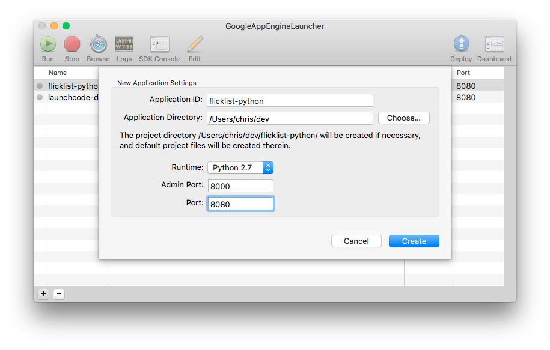
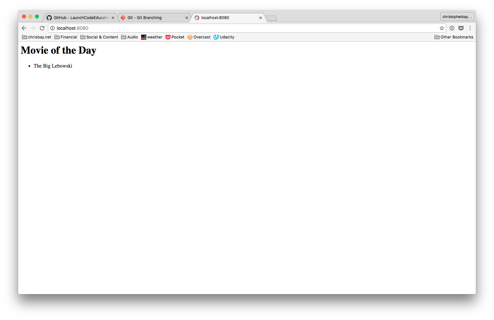

# Class 3

This is the first of many classes focused on the mechanics and ideas involved in building full-stack web applications. The term **full-stack** simply means that we'll look at every aspect of web applications, from the pages that a user views and interacts with, to the Python code that decides how to handle user submissions and requests, to the database that stores information.

In the Udacity lectures that you'll work through, you'll build several example web applications. We'll also build an application of our own, for in-class review and studios. This will be a single app that we add to in each class meeting. The mechanics of how this works will be the same for nearly every class going forward, so we'll cover them in a bit more detail this time, as a proper introduction to this strategy.

## Flicklist

Our app is called Flicklist. It'll start out small, but eventually will have a bunch of useful functionality that will allow users to create a list of movies they want to see, edit the list, mark movies as watched, and rate the movies they have watched.

### Project setup

Let's do some setup work to get our project ready. We'll only have to do this once.

#### Clone the repository

In a terminal, navigate to whichever directory you use to store your code projects. Leave the terminal open, and visit the [Flicklist repository page on GitHub](https://github.com/LaunchCodeEducation/flicklist-python). Copy the clone URL from the "Clone or download" dropdown.

Back in your terminal:
```
$ git clone [URL]
```

Where [URL] is replaced with the repository URL.

This creates a copy of the repository on your laptop.

#### Create new App Engine app

Now, open the Google App Engine Launcher. Create a new app using the app ID `flicklist-python`. The application directory should be *one level above* the repository directory that was just created by cloning the repository. So, if your copy of the repository is in `/home/student/code-projects/flicklist-python`, then you would set the application directory to `/home/student/code-projects/`. In previous usage of Google App Engine Launcher, the tool created a new directory for us using the specified project ID. In this case, however, we want to use the directory that is already there. If we get the application ID and directory settings correct, Google App Engine will do this just like we want.



Recall that you can set the port settings in the dialog to almost anything you like, as long as you know to access your app in the browser using the correct port. Here, we uses 8000 and 8080 for admin and application ports, respectively.

### Checking out the Walkthrough code

This step is only necessary if you wish to code along with the walkthrough that is done in class. *It is not required that you code along with class walkthroughs.* The code that we add to our application during the walkthrough will be available to you when you check out the code for the studio.

We include these steps for those that do want to code along, and to give you a better overall picture of how we're using Git for this step-by-step project. If you don't want to code along in class, you can skip ahead to **Checking out the Studio code**.

From the repository directory in your terminal, run the following command:
```
$ git checkout -b walkthrough3-work walkthrough3
```

This checks out a specific version of the code in the repository named `walkthrough3` (called a **tag**) into a new **branch** named `walkthrough3-work`. You can think of a branch as a parallel version of the main code base in the repository. We can work here, make changes, and check them in without affecting the main code base (usually called the `master` branch).

### Walkthrough 3: Hello, Movies!

In class, we'll walk through the steps to set up our new application that are outlined above. We'll discuss the dynamics of web applications:
* How do HTTP requests and responses work?
* What exactly is the application, and how does it "run"?
* GET and POST requests types
* Review of Python class syntax, and the `self` parameter
* Routes in a web appliction (i.e. how does a specific request get matched with a specific handler class based on the URL?)

We'll also add a bit of code to display a new heading and a "Movie of the Day", which is really just a hard-coded string. We'll make this more interesting in the studio.

If you follow along with the walkthrough, do the following to store your code in your local repository:
```
$ git add .
$ git commit -m "USEFUL MESSAGE"
```

### Checking out the Studio code

In a terminal, navigate to the repository directory, if you're not already there.

If you checked out the code for the walkthrough, switch back to the `master` branch:

```
$ git checkout master
```

Now, let's make sure we have the most up-to-date version of the code from the main repository:
```
$ git pull origin master
```

Great! Now we're ready to get the starter code for the studio:

```
$ git checkout -b studio3-work studio3
```

### Studio 3: Movie of the Day

Before you get started, fire up the Flicklist app using Google App Engine Launcher and visit the home page in a browser. You should see a page that looks like this.



If you don't, make sure the app is running and check the URL.

In Atom, open up the `flicklist-python` folder, and then the `main.py` file. Notice that you have a couple of TODOs, noted by comments. Completing these will upgrade our app from returing the same movie each time to a random movie from a list. Here are some more details on what you need to do.

1. At the top of the `getRandomMovie` method, create a Python list that contains at least 5 movie title strings.
1. In the same method, choose one of the titles randomly, and modify the return statement so that it returns the random selection instead of the hard-coded value "The Big Lebowski." Here are some tips:
    * Recall that we can generate random numbers in Python with the [`random` module](https://docs.python.org/2/library/random.html). Add `import random` to the top of `main.py` to make this module available to our code. Read the module documentation to determine which method within the module is best for the task at hand.
    * Write your code so that if you want to add a movie to your list, the only thing you need to do is modify the Python list storing the movie title strings. In other words, you *should not* use a specific number when generating the random list index.

When you're done with your studio code, check it in and switch back to the `master` branch.
```
$ git add .
$ git commit -m "USEFUL MESSAGE"
$ git checkout master
```
