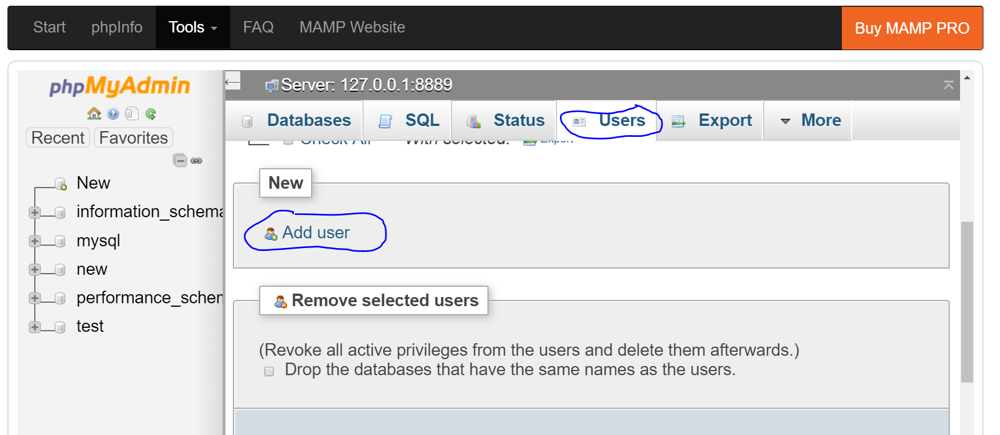
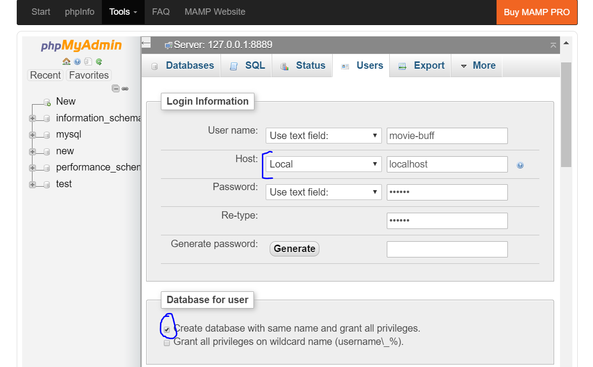
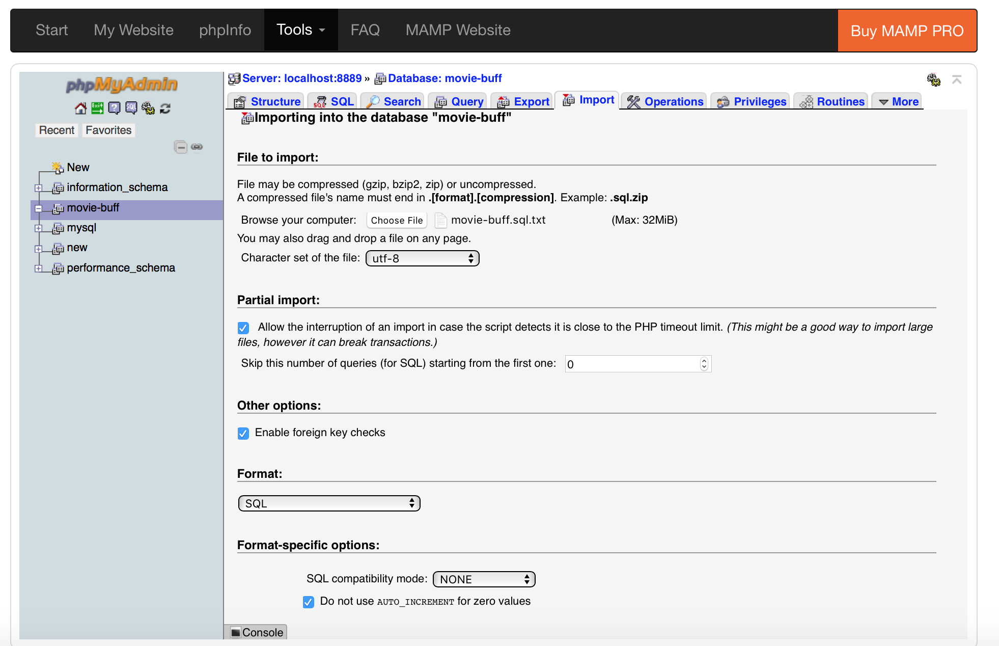
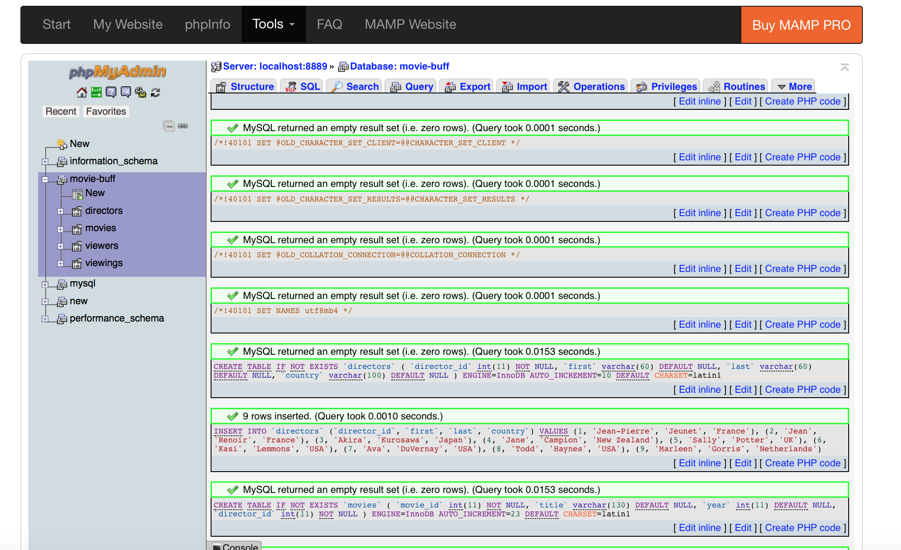
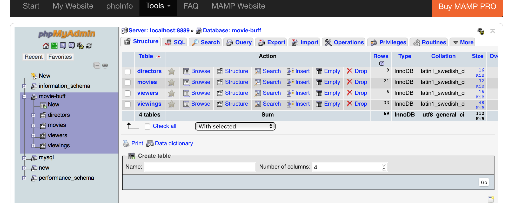
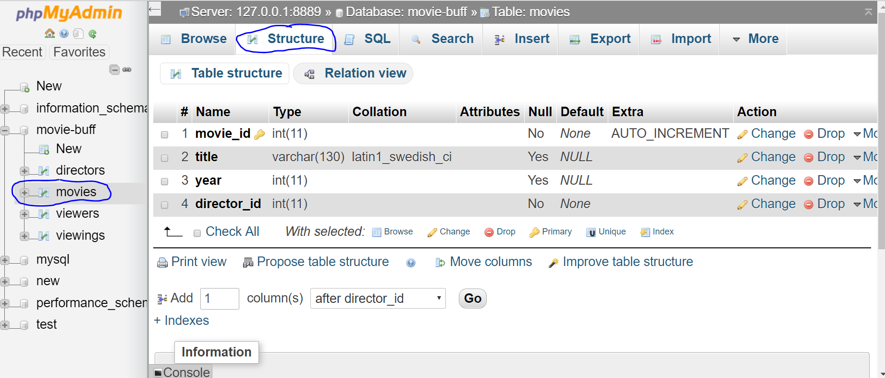
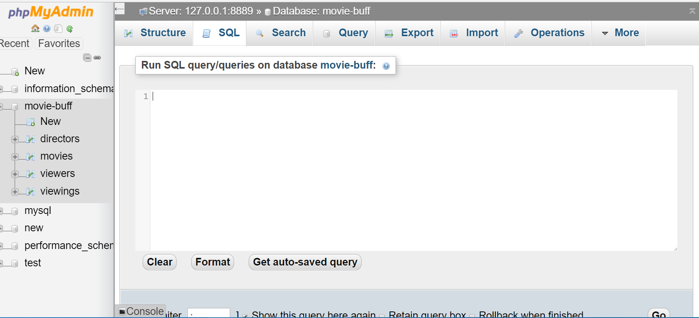
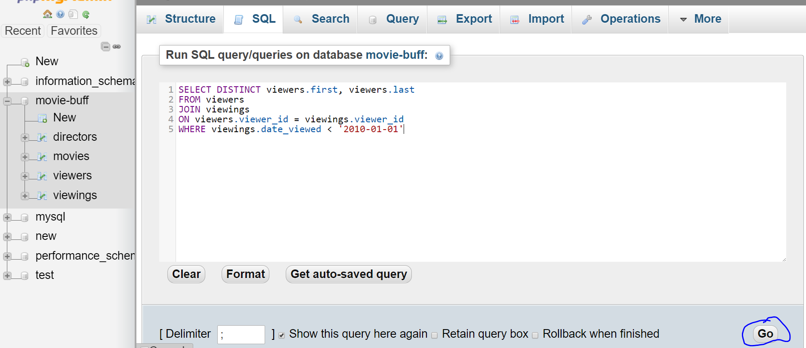
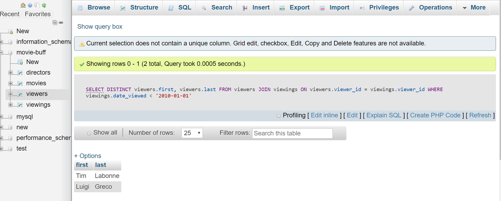

## Walkthrough

In this studio we'll be working in MAMP using the tool *phpMyAdmin*. We'll create a new user account and associated database for our movie-buffs project. Then we'll import a `.sql` file and get the tables we'll use from that. Then we'll perform some queries on that data.

### Database Setup

Let's start by setting up a new database for this project with a new, associated user account.

Start up MAMP. From the launcher window, select *Start Servers*. Once that button has turned green, choose *Open Start Page*. From the page that opens up in your browser, select *Tools > phpMyAdmin*.

Select *Users* (on a Mac it will be called *User accounts*).



Fill out the resulting form with info for your application. A good pattern to follow is that you should have a different user for each application, and the username should match the name of your application.

Set the *Host name* field to *Local* and set a password. For local development, it's acceptable to use a simple password. Just be sure that you don't use the same password on a production database if you deploy your application!

And be sure to check the first checkbox under *Database for user account*. If you don't do this, you'll have to create a database and set permissions manually. The image below shows what your settings for this user should look like.



Finally, press the small *Go* button at the bottom. 

### Import Tables From `.sql`

You should see the database name `movie-buff` on the left side. Double click on it to go into that database. 

Now, download this SQL file: [movie-buff.sql](downloads/movie-buff.sql) TODO: CHRIS-MAKE THIS FILE DOWNLOADABLE!

Then click the *Import* tab. Browse your computer to find the `movie-buff.sql` file you downloaded (on a Mac it may be `movie-buff.sql.txt`). Leave all the default selections as they are (the blue boxes with checkmarks), so your screen should look like this: 



Now press the *Go* button at the bottom.

Your screen will now look something like below:



You can click on the database `movie-buff` on the left side and it should now look like this:



## Studio

Sarah has a very eclectic taste in movies, but her friends admire it. Over the years, they've borrowed a lot of her DVDs, and she's set up a database to keep track of who has watched what so that she can make better recommendations for them based on what they've seen so far. 

There are four tables in the `movie-buff` database: `movies`, `directors`, `viewers`, and `viewings`. You can check out the structure of these tables by going to the "Structure" tab in your database and choosing a table. This will show you the column names and data types.



There is one table Sarah made that might not seem intuitive to have created: the `viewings` table. The structure of it is here: 


The purpose of this table is to keep track of "who watched what when". The *who* is the `viewer_id`, which is a foreign key that references the `viewer_id` in the `viewers` table. The *what* is the `movie_id` which is a foreign key that references the `movie_id` in the `movies` table. And the *when* is of course the `date_viewed` column with a `date` data type. Each viewing of a movie by one of Sarah's friends is captured as a unique record. 

This kind of table is very common in relational database design. It has many virtues including that it clearly links the `movies` and `viewers` table together and it makes the database more maintainable. For instance, you might have chosen to make a `viewing` table where you actually list the movie title and the name of the viewer. But if you did that then anytime some of that information changes - say a friend gets married and changes last names - you would now have to update the name of the viewer in *both* the `viewers` table *and* the `viewings` table. With this design, any updates you make to either the `movies` or `viewers` table will be reflected automatically in the results from queries on the `viewings` table.

Review this lesson from [Khan Academy](https://www.khanacademy.org/computing/computer-programming/sql/relational-queries-in-sql/a/splitting-data-into-related-tables) for a more in-depth explanation of why we break tables up this way.

If you get stuck on any of the tasks below, you can review lessons in [Khan Academy](https://www.khanacademy.org/computing/computer-programming/sql) or [w3schools](https://www.w3schools.com/sql/default.asp) to get ideas and remind yourself of the proper syntax.

### Your Task: 

Sarah created these tables and inserted all the data into them, but she needs your help to run some queries. You can use the *SQL* tab in the `movie-buff` databse to run queries. Just type your SQL statement(s) in the box and press the *Go* button.



As an example, say Sarah wants to know the first and last names of any of her friends who borrowed one of her movies before 2010. 

We know we'll want to use the `viewings` table, since that has the dates of when people have viewed her DVDs as well as their ids. And we know we want to use the `viewers` table since that has the first and last names of her friends. Since we want data from two tables, we know we'll likely need to use a `join`. We also know that the column in common between the two tables is the `viewer_id` column, so that will be what we join on. Our SQL statement will be:

```sql
SELECT DISTINCT viewers.first, viewers.last 
FROM viewers
JOIN viewings 
ON viewers.viewer_id = viewings.viewer_id
WHERE viewings.date_viewed < '2010-01-01'
```

In phpMyAdmin:



And the results:



Here are some of the things Sarah needs your help with:

1. Find out which countries the directors in her collection are from (and make sure your result set only lists each country only once).

2. Who are the French directors in her database?

3. What is the date of the first time someone viewed one of Sarah's movies?

4. How many movies in her collection were directed by people born in the USA?

5. What are the titles of the movies in her collection that were directed by Akira Kurosawa?

6. How many times has the movie "Talk to Me" been viewed?

7. When was the last time someone viewed one of her movies?

8. What is the id of the last-viewed movie?

9. What is the title of the first movie she loaned to a friend for viewing? 

10. What is the first and last name of the person who viewed the last-viewed movie?


#### Bonus Questions: For those who like a challenge!

11. Write the SQL query to display the DVDs that others have watched in order of most viewed to least viewed. What's the title of the most-viewed movie(s) in Sarah's collection? 

12. Find the email of everyone who has watched "The Tango Lesson", so Sarah can email them and ask what they thought of it.

13. Sarah is hosting a Kurosawa film festival soon and needs an email list to send out invites. What are the full names and emails of all her friends who have watched any movie by Akira Kurosawa?


