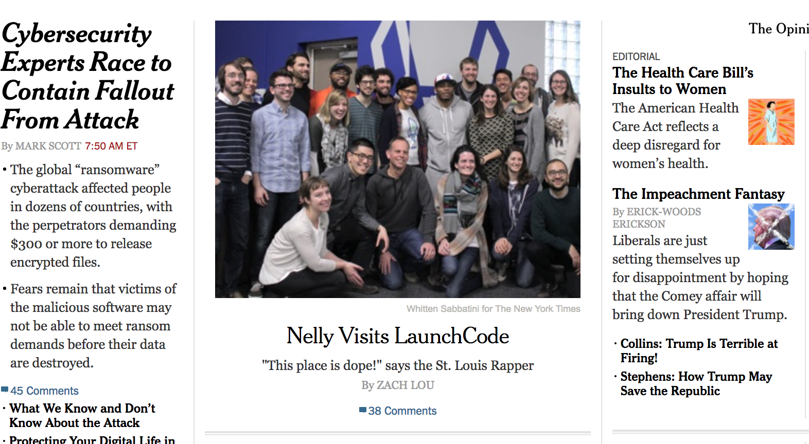

## Getting Ready: Developer Tools

As you've learned, debugging code is an essential part of coding. When it comes to working with web pages, browser developer tools are indispensable.

In this course, we will mostly use Firefox as our browser. If you haven't installed Firefox, you can get it from [Mozilla](https://www.mozilla.org/en-US/firefox/new/). Other browsers have good developer tools as well (Chrome, in particular) but we're going to stick with Firefox. If you are more comfortable with another browser, you'll find that most of the developer tools functionality exists in other browsers' dev tools as well.

Firefox's developer tools contain **a lot** of functionality, and we will only begin to touch on it here, learning more of its functionality later in the unit. In this class, we'll learn about the tools available for working with HTML elements.

## Walkthrough

Prior to the studio, the instructor will lead the class through an overview of some basic functionality of Firefox's dev tools, including but not necessarily limited to:
- How to open dev tools
- Inspecting an HTML element
- Modifying an element's HTML
- The difference between the content displayed when using "View Source" and what's in the "Inspector" tab

<aside class="aside-note" markdown="1">
The [full documentation](https://developer.mozilla.org/en-US/docs/Tools) for Firefox's developer tools covers these items, and much more.
</aside>

## Making Headlines

Pick a news site ([The New York Times](https://www.nytimes.com/), for example), and use your browser's developer tools to modify one of the main articles to use a picture and text of your choosing.

Have fun with this (see our example below), but be respectful of others and avoid overtly critical political or social commentary.



<aside class="aside-warning" markdown="1">
When linking to an image, pay attention to the protocol -- either `http` or `https` -- of the site you are modifying, and of the image you are including. You can find the protocol at the beginning of the image URL.

If the site you are modifying was loaded over `https` and your image uses `http` then the image may not load properly. You should try to add `s` to the image protocol, and if that doesn't work, look for another image or modify a site that uses `http`.
</aside>

<aside class="aside-pro-tip" markdown="1">
If you want to use an image of your own that is not already available via the internet, here's how:
- Upload the photo to a Dropbox account
- View the photo on [Dropbox](https://www.dropbox.com/) and select *Share*, then *Get link*, then *Go to link*
- You should now be viewing the image within Dropbox. Add `?raw=1` to the end of the URL in the location bar of your browser and hit Enter. The URL should look something like this:
    ```nohighlight
    https://www.dropbox.com/sc/qc3htnhv7fb3i2x/AAC5OzECOyBynstMDWawCZhxa?raw=1
    ```
- Copy the URL of the loaded image. You can use this URL within any HTML that you're editing.
</aside>

*Optional:* Share your creation in the `#showcase` channel on Slack, and see what others have created!

## Resources

* [Using Firefox's Page Inspector](https://developer.mozilla.org/en-US/docs/Tools/Page_Inspector)
* [Firefox DevTools Documentation](https://developer.mozilla.org/en-US/docs/Tools)
