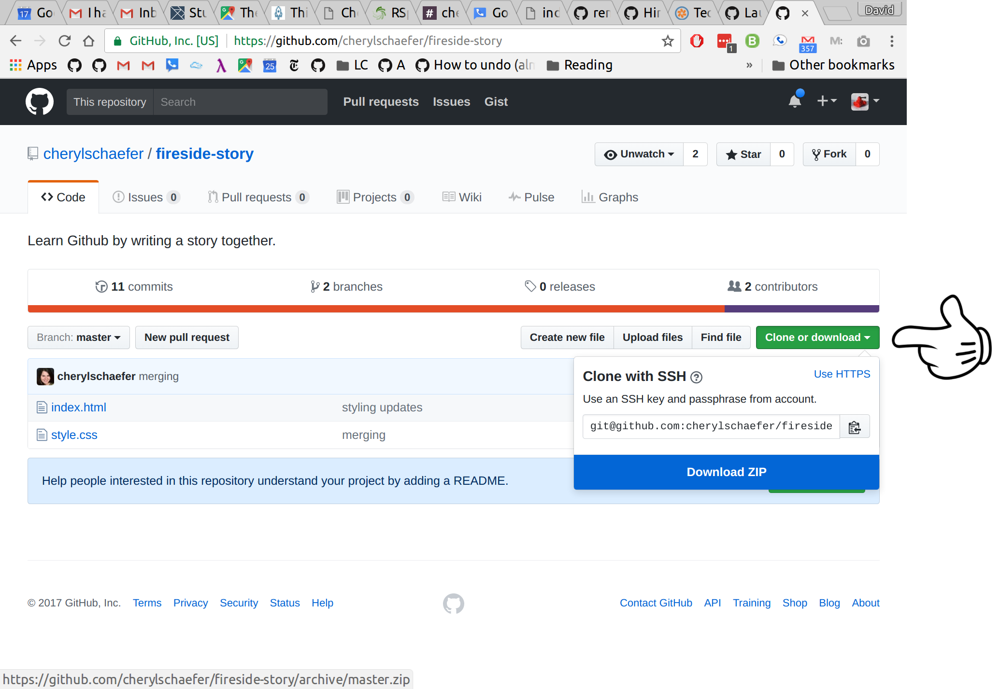
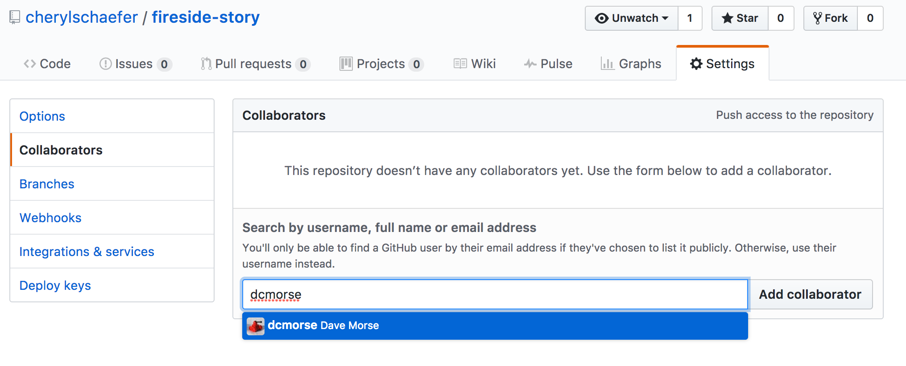
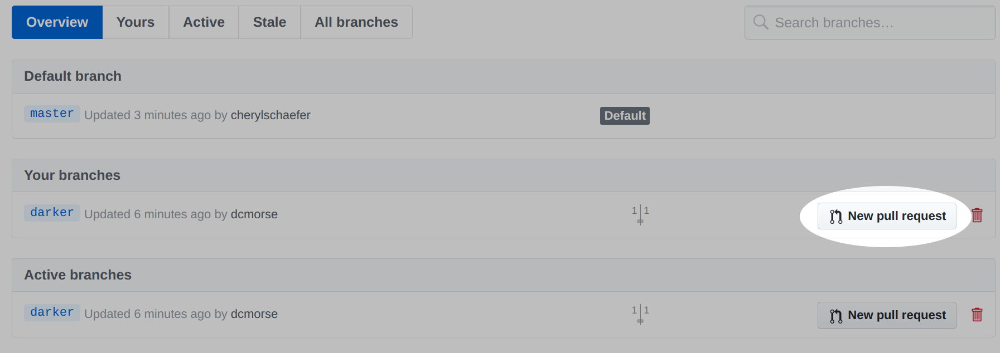
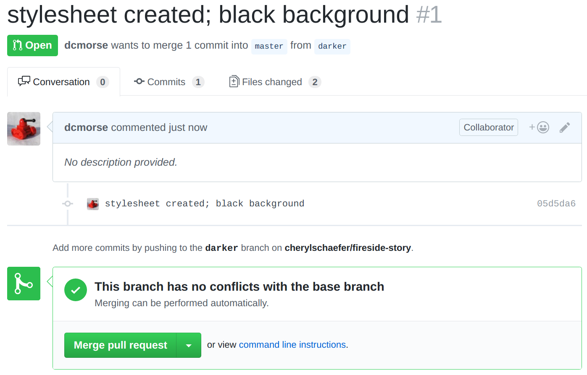
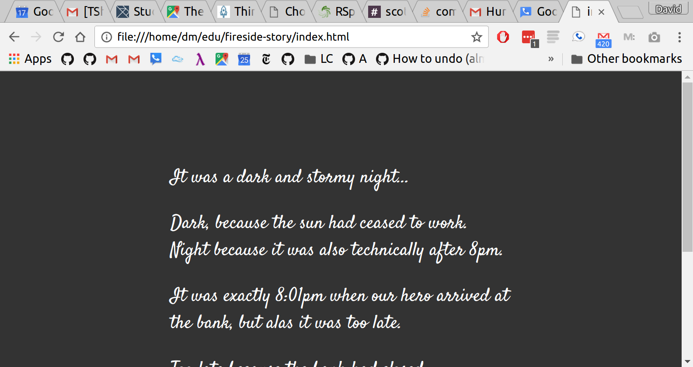

## Getting Ready: Code Together

Coding together allows you to work as a team so you can build bigger projects, faster.

In this studio, we will practice common git commands necessary when
multiple people are developing on the same code base. Today, you will
start out coding in tag-team shifts, and by the end you should have
a good idea of how to both be working on the same code at the same
time. You will learn how to:

- Quickly add Code in Pull + Push Cycles *(Important! This is the fundamental process we'll be practicing!)*
- Add a Collaborator to a Github Project
- Sharing Repositories on GitHub
- Create a Branch in Git
- Create a Pull Request in GitHub
- Resolve Merge Conflicts

This lesson reinforces

- Creating Repositories
- Cloning Repositories
- Working with Git Concepts: Staging, Commits, and Status

## Walkthrough

The instructor will discuss why Github is worth their study. You already know how to use a local git repository with one branch, giving you the ability to move your code forward and backward in time. Working with branches on GitHub allows multiple people to build features at the same time. Pull Requests act as a checkpoint when code flows from branch to branch.

Students *must* pair off for this exercise. If you have trouble finding a partner, ask your TF for help.

## Studio

We are going to play a game. We will play it just like you'd play around a campfire, but on a web page.

First, find a new friend to play the game with.

Feel free to share your story in the `#showcase` channel on Slack, and see what others have created!

You and your partner will alternate tasks, so designate one of you as **Player 1** and the other as **Player 2**. Even when it is not your turn to complete a task, read and observe what your partner is doing to completed theirs. The steps here mimic how a real-world collaborative Git workflow can be used within a project.

#### Player 1

### Create a New Repository

Navigate to your development folder. Follow these instructions to create a new project.

```nohighlight
$ mkdir fireside-story
$ cd fireside-story
$ git init
```

In that directory, open a new file `index.html` in the editor of your choice. Paste in this code:

```html
<html>
  <body>
    <p>It was a dark and stormy night...</p>
  </body>
</html>
```

Let's check that our html looks okay by opening it in a browser. You can do this by selecting File > Open File in your web browser, and navigating to the location of your new HTML file. The URL will look something like this: `file:///Users/cheryl/Development/fireside-story/index.html`.

Once you've seen this file in the browser, let's stage and commit it.

<pre><code class="nohighlight" style="color: #333">$ git status
On branch master

Initial commit

Untracked files:
  (use "git add <file>..." to include in what will be committed)

    <span style="color: red">index.html</span>

nothing added to commit but untracked files present (use "git add" to track)</code></pre>

The file is not staged. Let's add everything in this directory.

<pre><code class="nohighlight" style="color: #333">$ git add .
$ git status
On branch master

Initial commit

Changes to be committed:
  (use "git rm --cached <file>..." to unstage)

    <span style="color: green">new file:   index.html</span>

</code></pre>

We see that the file is staged. Let's commmit.

```nohighlight
$ git commit -m 'started story'
[master (root-commit) e1c1719] started story
 1 file changed, 5 insertions(+)
  create mode 100644 index.html
$ git log
commit 679de772612099c77891d2a3fab12af8db08b651
Author: Cheryl <cherylschaefer@gmail.com>
Date:   Wed Apr 5 10:55:56 2017 -0500

    started story

```


Great! We've got our project going locally, but we're going to need to make it accessible for player 2 also. Let's push this project up to Github.

### Share Your Repository On GitHub

Go to your Github profile in a web browser. Click on the + button to add a new repository ('repo').


Fill in the name and description. Uncheck the "initialize with README". Click *Create Repository*.

<aside class="aside-warning" markdown="1">If you initialize with a README, in the next step Git will refuse to merge this repo with the local repo. There's ways around that, but it's faster and easier to just create an empty repo here. </aside>


Now go back to your terminal and follow the instructions shown on Github which should be very similar to this:

```nohighlight
$ git remote add origin git@github.com:cherylschaefer/fireside-story.git
$ git push origin master
```

Now you should be able to confirm that Github has the same version of the project you have locally. (File contents in browser match those in terminal.) Click around and see what is there. You can read all your code through GitHub's web interface.


#### Player 2

### Clone a Project from GitHub

Go to player 1's github profile and find the fireside-story repo. Click on the green *Clone or download* button. Use SSH and not HTTPS. Copy the url to your clipboard.



In your terminal, navigate to your development folder and clone down the repo. The command should look something like this.

```nohighlight
git clone git@github.com:cherylschaefer/fireside-story.git
```

Now you can add a line to the story! Open the `index.html` file in your editor and add the next line of the story. Be creative -- the story can go anywhere! Just don't talk about what to write with your partner. Then commit your change.

```nohighlight
$ git status
On branch master
Your branch is up-to-date with 'origin/master'.
nothing to commit, working directory clean
$ git add index.html
$ git commit -m 'added second line of story'
```

Now we need to push up your changes so player 1 can use them as well.

```nohighlight
$ git push origin master
ERROR: Permission to cherylschaefer/fireside-story.git denied to player2.
fatal: Could not read from remote repository.

Please make sure you have the correct access rights
and the repository exists.
```

Great error message! It let us know exactly what went wrong - player 2 does not have security permissions to write to player 1's repo. Let's go fix that.

#### Player 1

### Add A Collaborator To A GitHub Project

In your web browser, go to your fireside-story repo. Click the *Settings* button then click on *Collaborators*. Enter in player 2's Github username and click *Add Collaborator*.



#### Player 2

You should receive an email invitation to receive permissions to this repo from player 1 through Github.


Now let's go enter that command again to push up our code.

```nohighlight
$ git push origin master
Counting objects: 9, done.
Delta compression using up to 4 threads.
Compressing objects: 100% (9/9), done.
Writing objects: 100% (9/9), 1.01 KiB | 0 bytes/s, done.
Total 9 (delta 8), reused 0 (delta 0)
remote: Resolving deltas: 100% (8/8), completed with 8 local objects.
To git@github.com:player2/fireside-story.git
   511239a..679de77  master -> master
```

Anyone reading the html through GitHub's browser interface should now see the new second line.

#### Player 1

Player 1 you might notice you don't have the second line on your computer. Go to the terminal and enter this command to pull that updated code in locally.

```nohighlight
$ git pull origin master
remote: Counting objects: 3, done.
remote: Compressing objects: 100% (2/2), done.
remote: Total 3 (delta 1), reused 3 (delta 1), pack-reused 0
Unpacking objects: 100% (3/3), done.
From github.com:cherylschaefer/fireside-story
   e0de62d..e851b7e  master     -> origin/master
Updating e0de62d..e851b7e
Fast-forward
 index.html | 1 +
 1 file changed, 1 insertion(+)
```

Now go in your editor, add a third line of story and push it up. You can have your story go anywhere! Try to tie it in with what the other player wrote, without discussing with them any plans on where the story will go.

Stage, commit and push your change.

#### Player 2

Player 2 you might notice now *you* don't have the third line on your computer. Go to the terminal and enter this command to pull that updated code in locally.

```nohighlight
$ git pull origin master
remote: Counting objects: 3, done.
remote: Compressing objects: 100% (2/2), done.
remote: Total 3 (delta 1), reused 3 (delta 1), pack-reused 0
Unpacking objects: 100% (3/3), done.
From github.com:cherylschaefer/fireside-story
   e851b7e..167684c  master     -> origin/master
Updating e851b7e..167684c
Fast-forward
 index.html | 1 +
 1 file changed, 1 insertion(+)
```

Now go in your editor, add and commit a fourth line of story and push it up. Again: be creative, but no planning!

You can both play like this for a while! But let's say player 2 wants to work a little extra on the project. You're not sure player 1 is keen on this change so let's put it in a branch. Branches are often used to organize new feature development.

### Create a Branch In Git

```nohighlight
$ git checkout -b darker
Switched to a new branch 'darker'
```

Open a new file `style.css` and paste this code in:
```
body {
  color: white;
  background-color: black;
}
```

Now link it in `index.html`. It should look something like this:

```html
<html>
  <head>
    <link rel="stylesheet" type="text/css" href="style.css">
  </head>
  <body>
    <p>It was a dark and stormy night...</p>
    ... your content here
  </body>
</html>
```

Now stage and commit the new file and changes to the existing file.

```nohighlight
$ git add .
$ git commit -m 'added style.css'
$ git push origin darker
```

You should both now be able to see a second branch appear in your repo in the browser. On your command line, you can type this command to see a list of the available branches:

```nohighlight
$ git branch
* darker
  master
```

Great! Now let's show the other player your work in GitHub and ask them to merge it in to the main branch.

### Create a Pull Request In GitHub

In your browser, go to the github project. Click on *branches* and the new branch name, *darker*.




If you are happy with your changes, click *New Pull Request*. Add some text in the description box to let player 1 know what you did and why.


This is what an opened pull request looks like:



#### Player 1

You will notice that you do not see this new `style.css` file locally. Type this command to see what branches are on your local coputer:

```nohighlight
$ git branch
* master
```

If you want to work with the branch before merging it in, you can do so by typing these commands:

```nohighlight
$ git fetch
...
$ git branch
  darker
* master
```
```nohighlight
$ git checkout darker
Switched to branch 'darker'
Your branch is up-to-date with 'origin/darker'.
```

Make a change and commit to this branch if you'd like -- you will see that the pull request in Github is updated to reflect the changes you've added. The context in the description box is not though, so be sure to add comments to the pull request to explain what you did and why.

To go back to the main branch type these commands:

```nohighlight
$ git checkout master
Switched to branch 'master'
Your branch is up-to-date with 'origin/master'.
```

You will see your files no longer have those changes that are in the darker branch. Let's go merge those changes in, so that the master branch adopts all the changes in the darker branch.

Go to the repo in Github. Click on `Pull Requests`. Explore here and see all the information Github shows you about the changes made.


When you're happy with the changes, merge them in. Click *Merge Pull Request* then *Confirm Merge*.


You should see this screen to show success:


Now you will need to pull updates to your master branch locally.

```nohighlight
$ git branch master
$ git pull origin master
```

Git is able to merge these files on its own.

### What happens if you both edit the same thing?

### 

#### Player 2

Let's change something about the style file. Our html is looking pretty plain. Let's pick a nice font and add some margins. Paste in something like this:

Add another link to your `index.html` file, right by the first link:
```html
     <link href="https://fonts.googleapis.com/css?family=Satisfy" rel="stylesheet">
```

And spice up your `style.css` file to look like this:

```css
body {
  color: white;
  background-color: #333;
  font-size: 150%;
  font-family: 'Satisfy', cursive;
  margin: 5em 25%;
}
```

The result:



Commit your changes and push it up to GitHub. If you don't remember how to do this, follow the instructions above. Make sure you're back in the `master` branch - if you're still in `darker`, then your changes will be isolated and we won't get the merge conflict you want to learn about.

Meanwhile...

#### Player 1

Let's change something about the style file that Player 2 just edited. Change it to look like this:

```
body {
  color: white;
  background-color: black;
  font-family: 'Sacramento', cursive;
  font-size: 32px;
  margin-top: 5%;
  margin-left: 20%;
  margin-right: 20%;
}
```

Don't forget to link the new font in your `index.html` file, beside the other link:

```
  <link href="https://fonts.googleapis.com/css?family=Sacramento" rel="stylesheet">
```

Commit your changes to branch `master` and push it up to GitHub. You should get an error message, how exciting!

```nohighlight
$ git push

To git@github.com:cherylschaefer/fireside-story.git
 ! [rejected]        master -> master (fetch first)
error: failed to push some refs to 'git@github.com:cherylschaefer/fireside-story.git'
hint: Updates were rejected because the remote contains work that you do
hint: not have locally. This is usually caused by another repository pushing
hint: to the same ref. You may want to first integrate the remote changes
hint: (e.g., 'git pull ...') before pushing again.
hint: See the 'Note about fast-forwards' in 'git push --help' for details.

```

Let's look around and see what's happening.

```nohighlight
$ git status
On branch master
Your branch is ahead of 'origin/master' by 3 commits.
  (use "git push" to publish your local commits)
nothing to commit, working directory clean
```

Let's pull these outstanding changes into our branch and resolve the errors.

```nohighlight
$ git pull
remote: Counting objects: 4, done.
remote: Compressing objects: 100% (3/3), done.
remote: Total 4 (delta 1), reused 4 (delta 1), pack-reused 0
Unpacking objects: 100% (4/4), done.
From github.com:cherylschaefer/fireside-story
   7d7e42e..0c21659  master     -> origin/master
Auto-merging style.css
CONFLICT (content): Merge conflict in style.css
Auto-merging index.html
CONFLICT (content): Merge conflict in index.html
Automatic merge failed; fix conflicts and then commit the result.
```

Git could not figure out how to merge files where it says `CONFLICT` so we will have to edit them ourselves. Let's start with `style.css`.

```
body {
  color: white;
<<<<<<< HEAD
  background-color: black;
  font-family: 'Sacramento', cursive;
  font-size: 32px;
  margin-top: 5%;
  margin-left: 20%;
  margin-right: 20%;
=======
  background-color: #333;
  font-size: 150%;
  font-family: 'Satisfy', cursive;
  margin: 5em 25%;
>>>>>>> 0c2165931f5f668959bad92d2f744efb402e049d
}
```

At the top and bottom, there is some code that could be merged without issue.
<br/>
`<<<<<<< HEAD` to `=======` is the version of the code that existed locally.
<br/>
`=======` to `>>>>>>> 0c2165931f5f668959bad92d2f744efb402e049d` is the version of the code that was pulled in (the hash will be unique to the commit).
<br/>
Let's unify our code -- make sure to remove the Git markers.

```
body {
  color: white;
  background-color: black;
  font-family: 'Sacramento', cursive;
  font-size: 150%;
  margin: 5em 25%;
}
```

You will need to do the same thing for the `index.html` file. You only need the link for *Sacramento*, not *Satisfy*. Commit again and push it up; you should not see an error message.


#### Player 2

Meanwhile, Player 2 is sitting home, minding their own business. A random `git status` seems reassuring:

```nohighlight
$ git status
On branch master
Your branch is up-to-date with 'origin/master'.
nothing to commit, working directory clean
```

Your local git thinks the status is quo. Little does it know that up at GitHub, the status is not quo. We'd find this out by doing either a `git fetch`, or if we just want the latest version of this branch, `git pull`:

```nohighlight
$ git pull
remote: Counting objects: 13, done.
remote: Compressing objects: 100% (8/8), done.
remote: Total 13 (delta 4), reused 13 (delta 4), pack-reused 0
Unpacking objects: 100% (13/13), done.
From github.com:cherylschaefer/fireside-story
   0c21659..e0de62d  master     -> origin/master
Updating 0c21659..e0de62d
Fast-forward
 index.html | 3 ++-
 style.css  | 4 ++--
 2 files changed, 4 insertions(+), 3 deletions(-)
```

Great Scott! Looks like Player 1 changed both `index.html` and `style.css`. Note that *player 2* didn't have to deal with the hassle of resolving merge conflicts. Since Player 1 intervened, git assumes that the team is okay with the way they resolved it, and **fast forwards** our local repo to be in sync with the upstream one. Let's look at `style.css` to make sure:

```css
body {
  color: white;
  background-color: black;
  font-family: 'Sacramento', cursive;
  font-size: 150%;
  margin: 5em 25%;
}
```

<br/>
Now make more changes but let Player 1 push up first so Player 2 can practice resolving the merge conflict.

Merge conflicts are a part of developing in a team. Resolve them carefully, so that they don't cause bugs in your code.

*Optional*: share your story in the `#fireside-story` channel on Slack, and see what others have created!

### Resources

* [Git Branching - Basic Branching and Merging](https://git-scm.com/book/en/v2/Git-Branching-Basic-Branching-and-Merging)
* [Adding Another Person To Your Repository](https://help.github.com/articles/inviting-collaborators-to-a-personal-repository/)
* [Resolving Conflicts In the Command Line](https://help.github.com/articles/resolving-a-merge-conflict-using-the-command-line/)
