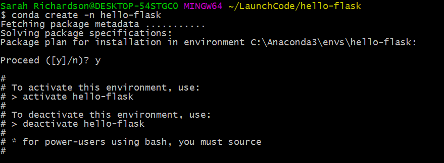
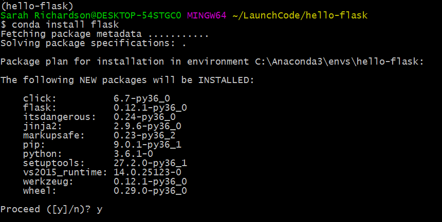

## Build a Development Web Application

In this tutorial, we'll configure and build a web application. The
configuration will be the hard part. When we're done, we'll be able to
visit the server in our browser, and it will display this heartening message:


### Founding your project and installing software

Navigate to your `lc101` directory, make a directory for your project, and `cd` (change directory) into it:

```
$ mkdir hello-flask
$ cd hello-flask
```

To download the flask library, we're going to need a way to store
libraries. So that this doesn't cause version mismatch issues with
other versions of Python on your system - including system libraries
which might be using Python - we'll install a virtual environment and
host all our libraries within it.

<aside class="aside-note" markdown="1">
Here, we're using the term "virtual environment" loosely. Rather than starting a full virtual machine, we're really just changing the PATH environment variable, which controls the order of directories that bash searches for programs.

```
(hello-flask) $ echo $PATH
/home/dm/hello-flask/flask/bin:/home/dm/.rbenv/plugins/ruby-build/bin:/home/dm/.rbenv/shims:/home/dm/.rbenv/bin:/home/dm/bin:/home/dm/.local/bin:/usr/local/sbin:/usr/local/bin:/usr/sbin:/usr/bin:/sbin:/bin:/usr/games:/usr/local/games:/snap/bin:/usr/lib/jvm/java-8-oracle/bin:/usr/lib/jvm/java-8-oracle/db/bin:/usr/lib/jvm/java-8-oracle/jre/bin
```
</aside>

To create a virtual environment with Conda, we'll do the following:

1. In your `hello-flask/` directory, create a virtual environment named `hello-flask` like so:
`conda create -n hello-flask`



2. Activate the virtual environment using `source activate hello-flask`


3. Install flask into your virtual environment with the command `conda install flask`



*Tip:* If you need to deactivate the virtual environment, use the command ``source deactivate``.


<aside class="aside-note" markdown="1">
The above pictures show how these commands will look in Git Bash. Mac Terminal will look slightly different.
</aside>

Now we're ready to build our web application!

### Building a web application line by line

First, let's initialize this project as a Git repository.

```nohighlight
$ git init
```

From your `~/lc101/hello-flask/` directory, create a new file named `main.py` and then open up the project in Visual Studio Code.

```nohighlight
$ touch main.py
$ code .
```

<aside class="aside-note" markdown="1">
The name `main` isn't special, we just picked it. Since this will be the "main" file that will need to be run for our application to start up, it makes sense.
</aside>

Open `main.py` in the code editor. Then type this in, considering each line as you do:

```python
from flask import Flask

app = Flask(__name__)
app.config['DEBUG'] = True

@app.route("/")
def index():
    return "Hello World"

app.run()

```

What's all this do?

- `from flask import Flask`: this imports the `Flask` class from the `flask` module.
- `app = Flask(__name__)`: app will be the object created by the constructor `Flask`. `__name__` is a variable controlled by Python that tells code what module it's in.
- `app.config['DEBUG'] = True`: the `DEBUG` configuration setting for the Flask application will be enabled. This enables some behaviors that are helpful when developing Flask apps, such as displaying errors in the browser, and ensuring file changes are reloaded while the server is running (aka "host swapping")
- `@app.route("/")`: this is a decorator that creates a mapping between the path - in this case the root, or  "/", and the function that we're about to define
- `def index():`: Ah, familiar ground! We define `index`, a function of zero variables
- `return "Hello World"`: Our function returns a string literal.
- `app.run()`: Pass control to the Flask object. The run function loops forever and never returns, so put it last. It carries out the responsibilities of a web server, listening for requests and sending responses over a network connection.

Here goes. Go to your terminal and start things up. The output should look like:

```bash
$ python main.py
 * Running on http://127.0.0.1:5000/ (Press CTRL+C to quit)
```

From the computer running this process, point your browser at http://localhost:5000/ and see what's up. Maybe this?!


If so: congrats! You've built a dynamic web app!

<aside class="aside-note" markdown="1">
If that didn't work for you, refer to some common errors and fixes below, and carefully retrace the steps.
</aside>

Go back to the terminal and note that there's an extra line now:

```bash
$ python main.py
 * Running on http://127.0.0.1:5000/ (Press CTRL+C to quit)
127.0.0.1 - - [10/Apr/2017 17:02:19] "GET / HTTP/1.1" 200 -
```

The HTTP request you made to the Flask application server has been logged. In particular, notice the request line, `GET / HTTP/1.1`, and response code of 200. Neat, huh?

To stop the application, do as suggested in the terminal output and press `CTRL+C`

### Committing Our File

Let's wrap up by putting our file in the local Git repository. If you run `git status` you'll see that we have a directory that was created by Visual Studio Code.

```nohighlight
$ git status
On branch master

Initial commit

Untracked files:
  (use "git add <file>..." to include in what will be committed)

	.vscode/
	main.py

nothing added to commit but untracked files present (use "git add" to track)
```

We don't want to put this in our repository, so let's create a `.gitignore` file so we can, well, tell Git to ignore it.

```nohighlight
$ touch .gitignore
```

Back in VS Code, add this line to `.gitignore`:

```nohighlight
.vscode/
```

Then run `git status` again to see what's changed.

```nohighlight
$ git status
On branch master

Initial commit

Untracked files:
  (use "git add <file>..." to include in what will be committed)

	.gitignore
	main.py

nothing added to commit but untracked files present (use "git add" to track)
```

Great! Now, add and commit the files.

```nohighlight
$ git add .
$ git commit -m "Create Hello World app"
[master (root-commit) 05bc1ae] Create Hello World app
 2 files changed, 10 insertions(+)
 create mode 100644 .gitignore
 create mode 100644 main.py
```

#### Common Errors

*Virtual environment not activated*

If you see this error:

```nohighlight
Traceback (most recent call last):
  File "main.py", line 1, in <module>
    from flask import Flask
ImportError: No module named flask
```

This means your virtual environment was not activated. Enter this command to start it: `source activate hello-flask` and then try again.

*Trying to run the app from the wrong directory*

If you see this error:

```nohighlight
$ python main.py
python: can't open file 'main.py': [Errno 2] No such file or directory
```

Then your working directory is something other than where you put the `main.py` file (which is most likely `~/lc101/hello-flask/`). Use `pwd` to figure out where you are, and adjust accordingly.
